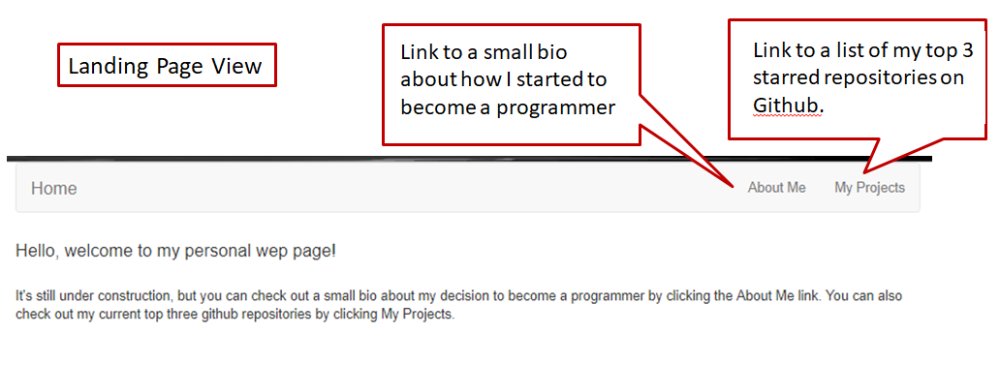
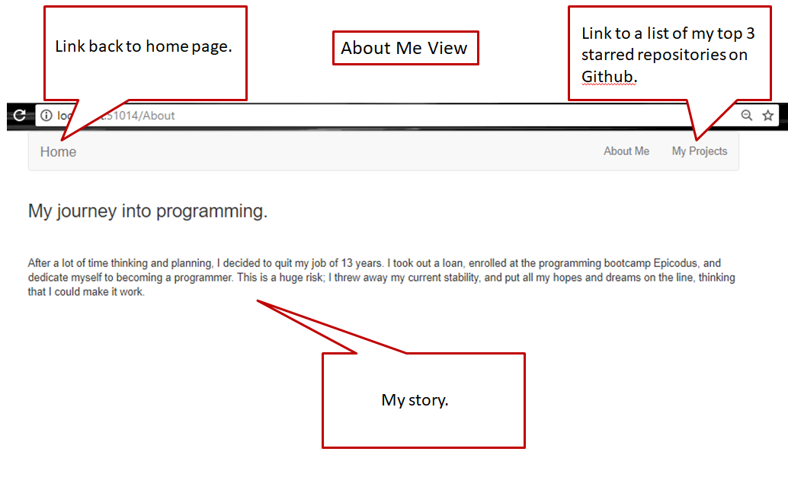
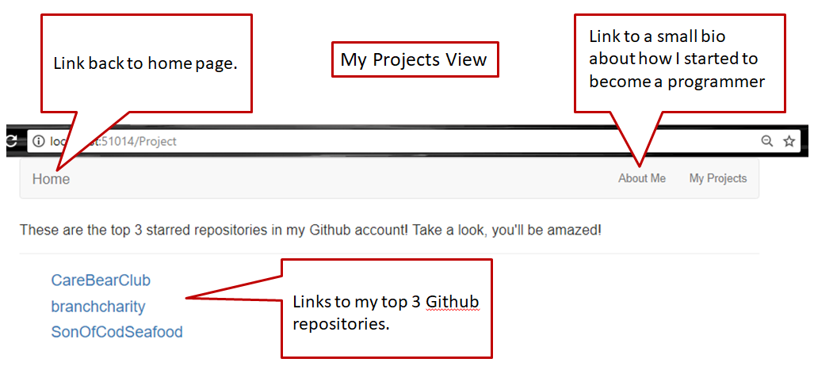

# MyWebpage

#### Small webpage for me to show off.

#### By _**Guy Anderson**_

## Description

_Webpage will showcase a small bio about me and have quick links to my github repositories._

## specs
Uses a github API call to get my top 3 starred repositories.
#### Landing page

#### About Me page

#### Top 3 github repos page

## Setup/Installation Requirements

* _Go to Github repository page._
* _Click the "download or clone" button and copy the link to MySite_
* _In your computers terminal type "git clone" & paste the copied link._
* _Open in visual studio_
* _Create an EnvironmentVariables.cs file in the Models folder._
* _    public class EnvironmentVariables
    {

        public static string AccountSid = "xxxx";

        public static string AuthToken = "xxxx";
    }_
* create the variables above where AccountSid is you github username and AuthToken is your github PW. 
* In Visual studio run program with the play button. This will launch the website website.

## Will add later:
* _Use github user cridentials to login in and get my repos instead of them making a git ignore file._

## Technologies Used

_HTML, css, Bootstrap, ASP.NET, Visual Studio, Entity Framework, Github API_

### License

Copyright (c) 2017 **_FunGuy Entertainment_**# Markdown file 